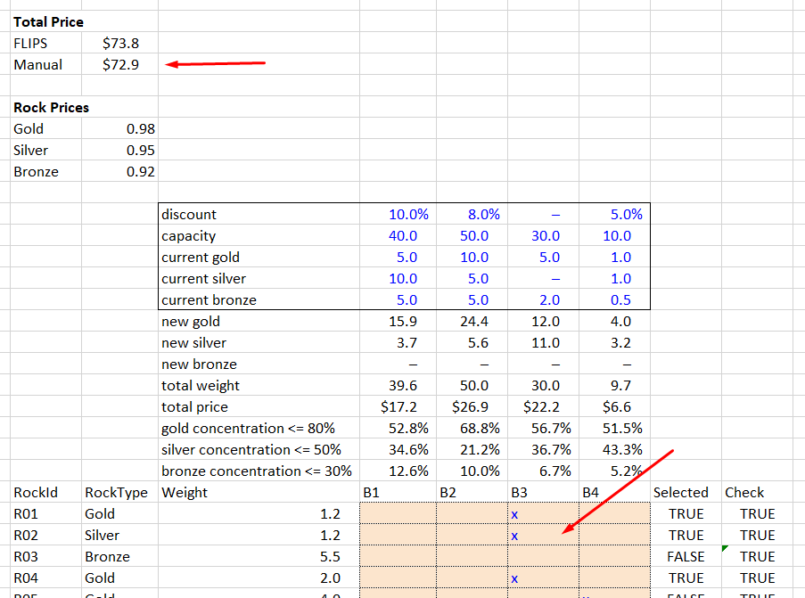

# Flips Example
Trying out [Flips](https://github.com/fslaborg/flips).

We have just traveled out to the wild wild west in search
of gold and want to get the most money for the rocks we find.
Each rock we find has a specific market price.

```fsharp
match rock.RockType with
| Gold -> 0.98<usd/kg>
| Silver -> 0.95<usd/kg>
| Bronze -> 0.92<usd/kg>
```

We have a few different buyers that will purchase our rocks, but
each one has a limit on the total amount they will buy (the capacity),
and how much they will pay (a discount to the market price).

```fsharp
let buyers =
    [ { BuyerId = %"B1"; Capacity = 40.0<kg>; CurrentGold = 5.0<kg>; CurrentSilver = 10.0<kg>; CurrentBronze = 5.0<kg>;  Discount = 0.1; }
      { BuyerId = %"B2"; Capacity = 50.0<kg>; CurrentGold = 10.0<kg>; CurrentSilver = 5.0<kg>; CurrentBronze = 5.0<kg>; Discount = 0.08 }
      { BuyerId = %"B3"; Capacity = 30.0<kg>; CurrentGold = 5.0<kg>; CurrentSilver = 0.0<kg>; CurrentBronze = 2.0<kg>; Discount = 0.0 }
      { BuyerId = %"B4"; Capacity = 10.0<kg>; CurrentGold = 1.0<kg>; CurrentSilver = 1.0<kg>; CurrentBronze = 0.5<kg>; Discount = 0.05 } ]
```

Also, the buyers don't want too much of any one rock (they like to diversify),
so they limit the weight concentration of gold, silver, and bronze that they own. 
(e.g., the weight of gold the buyer owns divided by total weight
of all rocks the buyer owns must be less than or equal to 80%).

```fsharp
let maxGoldConcentration = 0.8
let maxSilverConcentration = 0.5
let maxBronzeConcentration = 0.3
```

## Manual Optimization

First try to manually divide the rocks into each bucket using
the [manual.xlsx](./manual.xlsx) Excel file.
__Take note of how much time you spend__.



> The best I could do manually was $72.9

## FLIPS Optimization

### Setup
Install [.NET SDK 5.0](https://dotnet.microsoft.com/download)

### Usage
Run the [optimize.fsx](./optimize.fsx) script.
```
dotnet fsi optimize.fsx
```
```
Total buyer capacity: 130
Total rock weight: 188.40000000000003
Real: 00:00:00.844, CPU: 00:00:01.218, GC gen0: 0, gen1: 0, gen2: 0
Total price: $73.791000
```

> The solution is written to [data/solution.csv](./data/solution.csv)
You can plug into the Excel file and check that the output is the same.

## Conclusion
Use FLIPs and make more money.

## Resources
- [FLIPS Homepage](https://flipslibrary.com/#/)
- [Matthew Crews Blog](https://matthewcrews.com/)
- [F# Scripting Tips](https://brandewinder.com/2016/02/06/10-fsharp-scripting-tips/)
